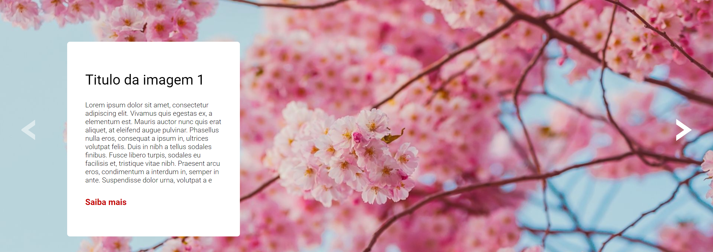

# Carrossel(slider) de imagens

Este é um desafio proposto no curso do [Dev em Dobro(DevQuest)](https://www.instagram.com/devemdobro)

## Índice

- [Visão geral](#visão-geral)
   - [O desafio](#o-desafio)
   - [Captura de tela](#captura-de-tela)
- [Meu processo](#meu-processo)
   - [Construído com](#construído-com)
   - [O que aprendi](#o-que-aprendi)
- [Autor](#autor)

## Visão geral

### O desafio
O desafio proposto pelo curso foi criar um carrossel de imagens do tipo slider e mostrar a imagem correspondente contendo sua descrição. Ao clicarmos na seta de avançar a imagem deve avançar, ao clicarmos na seta de retroceder a imagem deve voltar, mas se caso for a ultima ou primeira imagem a seta deve ficar transparente não sendo possivel clicar nela.

Os usuários devem ser capazes de:

- Ver o layout ideal para a página, dependo do tamanho da tela de seu desktop(não é responsivo para mobile)
- Ao clicar na seta o usuario deve ver a imagem correpondente e sua descrição
- Caso for a primeira imagem a seta esquerda(voltar) ficara um pouco transparente e não vai funcionar, e caso for a ultima imagem a seta direita(avançar) tera o mesmo efeito

### Captura de tela




## Meu processo

### Construído com

- Marcação HTML5 semântica
- Propriedades personalizadas CSS
- Flexbox
- Metodos e funções em JavaScript para a interação
- Manipulação do DOM

### O que eu aprendi

Consegui reforçar meus conhecimentos em JavaScript e consegui aprender bastante como funciona suas funções, metodos e aprendi sobre como tratar melhor um erro, e o escopo de suas variaveis 

```js
function verificarClique() {
    if (clickCount === 3) {
        btnDireito.removeEventListener(`click`, cliqueDireito)
    } else if (clickCount === 2) {
        btnEsquerdo.addEventListener(`click`, () => {
            btnDireito.addEventListener(`click`, cliqueDireito)
        })
    }
}
```

## Autor

- Linkedin - [Luis Fernando Macedo](https://www.linkedin.com/in/luis-fernando-macedo-7791ba219)
- Instagram - [Luis Fernando](https://www.instagram.com/luis_fernand0._)